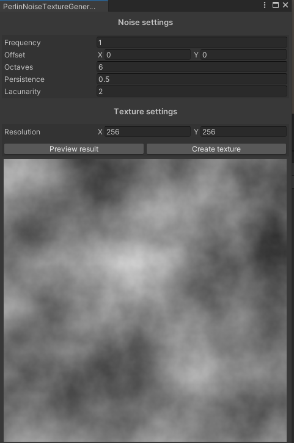

# About
This Unity project contains a tool for 2D Perlin Noise texture generation. It is jobified & burst compiled so it is quite fast even for high resolution textures. Note that although it is completely usable, it is very simple. I might add more fancy settings such as FBM generation or 3D noise in the future if I needed it for other projects.

To show the window go to Window -> Tools -> Perlin noise texture generator

# Preview

